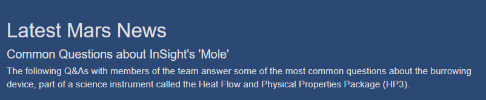
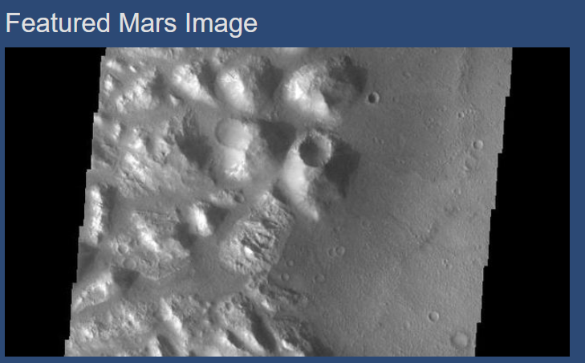
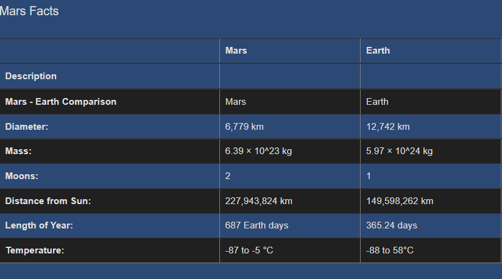
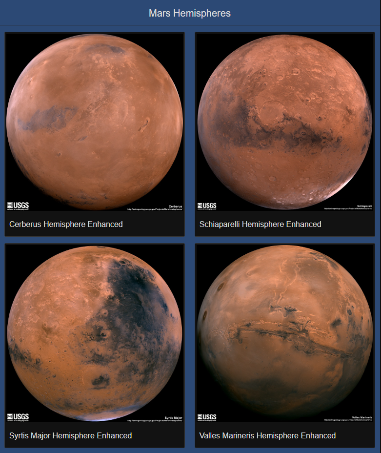
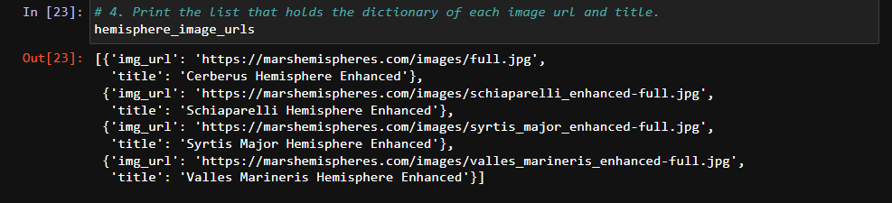
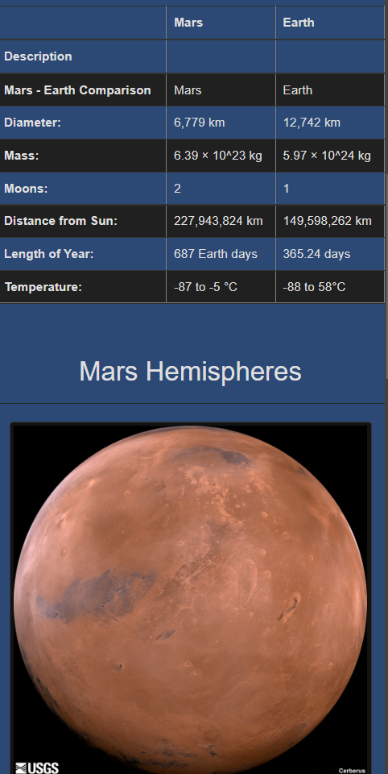

# Mission-to-Mars

## Overview
The following project implemented Web Scraping in Python with Beautiful Soup. The goal was to develop an automated web browser, using web scrapping to extract data from websites, and extract specific information out of web pages. The topic of interest of the information was Mars, extracting images and information about the planet. 

For this Pandas was used and the dependencies Splinter, BeautifulSoup. Mongo DB was used to get the information and Flask for visualisation of the app. 

## Methods
Web scrapping using: Python, Jupyter Notebook, Pandas, HTML, CSS, Splinter, MongoDB, BeautifulSoup and Flask

## Objective 
Develop an automated web browser, using web scrapping to extract data from websites. 

## Results:
Scrapping was successfully implemented and presented in a website featuring Mars Information. 

The different components were: 

- Scrape New Data (button)
 

- Latest Mars News (modified by each scrapping)
 

- Featured Mars Image (picture)

- Mars Facts (table)

- Mars hemispheres (pictures) 

### Results 1 : BeautifulSoup and Splinter scrape:
- List of Hemispheres image URL's 
 

### Results 2: Webpage collected information with Mongo DB: 
- Hemispheres pictures retrieval 
 

### Results 3: Mobile-responsive, Bootstrap components
As seen in the following pictures, the webpage was formatted making it visually attractive as well as responsive for mobile tablet and desktop formatting, using Bootstrap components as seen in [index](templates/index.html)

